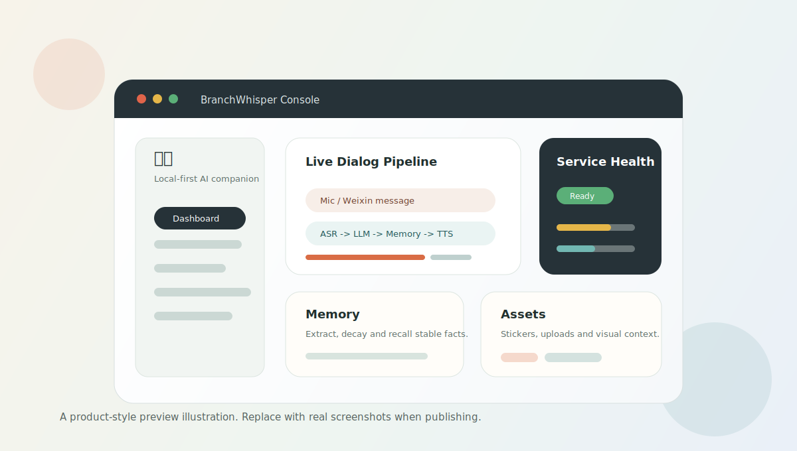
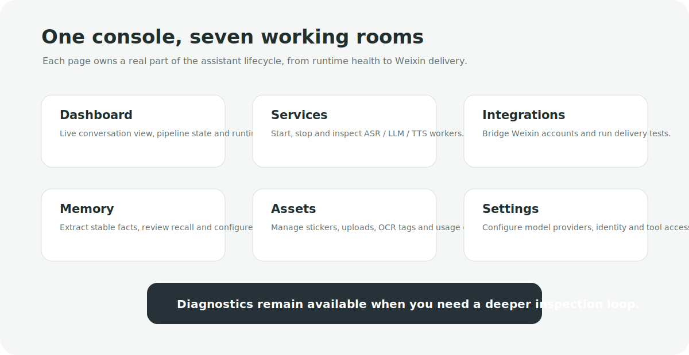
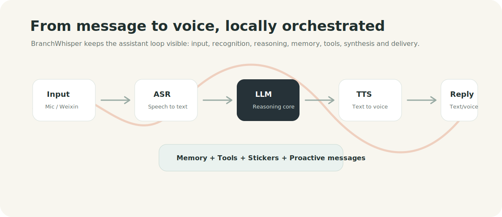

# BranchWhisper

> Local-first AI companion console for voice dialog, model orchestration, memory, stickers, tools and Weixin delivery.

<p align="center">
  
</p>

<p align="center">
  <a href="#quick-start"></a>
  <a href="#features"></a>
  <a href="#weixin--openclaw"></a>
</p>

BranchWhisper is a local-first assistant control room. It brings together browser voice chat, ASR, LLM, TTS, long-term memory, tool calling, sticker assets, proactive messages and optional Weixin/OpenClaw integration in one console.

It is built for people who want a companion-like assistant that can be inspected, tuned and extended locally instead of hidden behind a black-box app.

## What It Feels Like

- Talk through the browser, then watch the voice pipeline move through ASR, LLM and TTS.
- Connect a Weixin personal-account bridge and let the same dialog core reply by text, stickers or voice.
- Manage local and API model providers from a visual console.
- Review memory before it becomes long-term context.
- Tune tools, weather/search/map access, proactive greetings and runtime services without editing code.

<p align="center">
  
</p>

## Features

| Area | What BranchWhisper Provides |
| --- | --- |
| Voice dialog | Browser audio input, WebSocket dialog, VAD, ASR, LLM response and TTS playback. |
| Model control | Local/API provider profiles for ASR, LLM and TTS, plus service start/stop/health tracking. |
| Weixin integration | OpenClaw bridge for personal-account message polling and reply delivery. |
| Memory | Local memory store, extraction checks, decay rules and recall preview. |
| Tools | Built-in weather, time, search, hot news, URL fetch, finance and map-style tools, with custom HTTP tools. |
| Assets | Sticker upload, metadata, OCR/tag context and usage matching. |
| Proactive behavior | Greetings, reminders and follow-up policy through explicit delivery channels. |
| Product console | Vue 3 app with dashboard, services, integrations, memory, assets and settings pages. |

## How It Works

<p align="center">
  
</p>

```text
Browser mic -> WebSocket -> VAD -> ASR -> LLM -> TTS -> Browser playback
Weixin message -> OpenClaw bridge -> BranchWhisper dialog core -> text / sticker / voice reply
```

The dialog core stays in the backend. External channels such as Weixin only adapt inbound/outbound messages; they should not own the assistant's business logic.

## Quick Start

For a fresh computer without local model environments, start with the API-first desktop path:

```text
docs/deployment/desktop-environment-guide.md
```

On Windows, the local desktop build can be copied to:

```text
C:\Users\Me\Desktop\BranchWhisper.exe
```

To build a desktop app that starts a packaged backend instead of relying on a manually opened terminal:

```powershell
powershell -NoProfile -ExecutionPolicy Bypass -File scripts\build_windows_desktop.ps1 -BuildBackend
```

Start the backend:

```bash
wsl -d Ubuntu-24.04 --cd /home/me/workspace/BranchWhisper /home/me/miniconda3/bin/conda run -n qwen3-asr python backend/main.py --host 127.0.0.1 --port 7860
```

Open the console:

```text
http://127.0.0.1:7860
```

During frontend development:

```bash
cd frontend
npm install
npm run dev
```

Open:

```text
http://127.0.0.1:5173
```

## Console Pages

| Page | URL | Purpose |
| --- | --- | --- |
| Dashboard | `/` | Conversation, runtime state and assistant pipeline overview. |
| Services | `/app/services` | ASR, LLM, TTS service control, logs and health. |
| Integrations | `/app/integrations` | Weixin/OpenClaw accounts, bridge state and delivery tests. |
| Memory | `/app/memory` | Memory browser, admission tests, recall checks and decay settings. |
| Assets | `/app/assets` | Sticker and upload library, metadata and context matching. |
| Settings | `/app/settings` | Identity, appearance, providers, tools and behavior settings. |

## Runtime Data

Runtime files live in:

```text
runtime/
```

This directory contains local settings, service profiles, conversations, memory databases, uploads, stickers, integration media and service logs. It is ignored by Git except for `runtime/README.md`.

Keep secrets and personal chat data in `runtime/` or environment variables. Do not commit `.env`, generated media, logs, databases, model weights or local credentials.

## Model And Service Profiles

The settings page saves service profiles to:

```text
runtime/service_profiles.json
```

You can also start BranchWhisper with an explicit config:

```bash
wsl -d Ubuntu-24.04 --cd /home/me/workspace/BranchWhisper /home/me/miniconda3/bin/conda run -n qwen3-asr python backend/main.py --host 0.0.0.0 --port 7860 --service-config /path/to/service_profiles.json
```

Use portable path tokens in profiles:

| Token | Meaning |
| --- | --- |
| `${PROJECT_ROOT}` | This BranchWhisper repository. |
| `${WORKSPACE_ROOT}` | Parent workspace that contains model folders such as `Qwen3-ASR`, `llama.cpp` or `CosyVoice`. |
| `BRANCHWHISPER_WORKSPACE_ROOT` | Environment override when models are not beside the repository. |

Legacy AutoDL-style absolute paths are migrated when service profiles are loaded.

## Weixin / OpenClaw

The Weixin personal-account integration depends on Node.js, npm, OpenClaw, ffmpeg and `silk-wasm`.

```bash
npm install -g openclaw
npm install -g @tencent-weixin/openclaw-weixin-cli
npm install -g silk-wasm
openclaw --version
```

If the console cannot detect `node`, `npm` or `openclaw`, start BranchWhisper from a shell that has the correct `PATH`.

The bridge flow is:

```text
OpenClaw getupdates -> /api/integrations/dialog -> BranchWhisper dialog -> OpenClaw sendmessage
```

## Project Structure

```text
BranchWhisper/
  backend/                    FastAPI backend, APIs, dialog runtime and integrations
    app/                      App factory, lifecycle and background tasks
    api/                      REST API routers
    dialog/                   WebSocket dialog session
    engagement/               Proactive messages and reminders
    integration_runtime/      OpenClaw / Weixin bridge runtime
    media/                    Avatars, images, stickers and vision helpers
    repositories/             Data access adapters
    service_runtime/          ASR / LLM / TTS process control
    tools/                    Memory and tool runtime
  frontend/                   Vue 3 + Vite + Pinia console
  services/                   Standalone local services, including TTS helpers
  configs/                    Local service configuration templates
  scripts/                    Startup and static check scripts
  docs/                       Architecture, module and API documentation
  runtime/                    Local generated data, ignored by Git
```

## Development Checks

Run these after structural changes:

```bash
wsl -d Ubuntu-24.04 --cd /home/me/workspace/BranchWhisper /home/me/miniconda3/bin/conda run -n qwen3-asr python scripts/check_backend_quality.py
wsl -d Ubuntu-24.04 --cd /home/me/workspace/BranchWhisper /home/me/miniconda3/bin/conda run -n qwen3-asr python -m compileall backend services
wsl -d Ubuntu-24.04 --cd /home/me/workspace/BranchWhisper /home/me/miniconda3/bin/conda run -n qwen3-asr python scripts/check_static_imports.py
node --check backend/integration_runtime/weixin_voice_sender.mjs
cd frontend && npm run check && npm run build
```

## Documentation

Start with:

- `docs/architecture/overview.md`
- `docs/architecture/request-lifecycle.md`
- `docs/architecture/runtime-files.md`
- `docs/modules/dialog.md`
- `docs/modules/service-control.md`
- `docs/modules/integrations.md`
- `docs/modules/memory.md`
- `docs/modules/media.md`
- `docs/api/rest-api.md`
- `docs/api/websocket-dialog.md`

## Roadmap

- Cleaner first-run setup for local/API model profiles.
- Better screenshots and guided onboarding for product publishing.
- More reliable Weixin voice delivery diagnostics and fallback modes.
- Smart-home WebSocket ingestion for board-side microphone audio.
- App-style external presentation layer on top of the current service console.

## Contributing

BranchWhisper is still moving quickly. Keep changes small, verify runtime behavior, and avoid committing user data or generated artifacts.

Before opening a pull request:

```bash
wsl -d Ubuntu-24.04 --cd /home/me/workspace/BranchWhisper /home/me/miniconda3/bin/conda run -n qwen3-asr python scripts/check_backend_quality.py
wsl -d Ubuntu-24.04 --cd /home/me/workspace/BranchWhisper /home/me/miniconda3/bin/conda run -n qwen3-asr python -m compileall backend services
wsl -d Ubuntu-24.04 --cd /home/me/workspace/BranchWhisper /home/me/miniconda3/bin/conda run -n qwen3-asr python scripts/check_static_imports.py
cd frontend && npm run check && npm run build
```

## Naming

The project name is **BranchWhisper**. Older runtime config keys may still mention `buding`, `LoveChoice` or the Chinese name `枝语`; those are compatibility leftovers and should not be removed without a migration plan.
