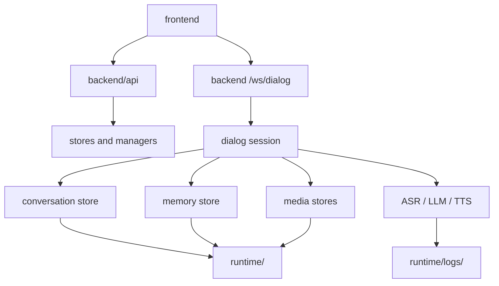

# Data Flow

BranchWhisper stores local user data under `runtime/` and uses JSON or SQLite depending on the feature.

## Important Data

- Conversations: `runtime/conversations/`
- Memory: `runtime/memory.sqlite3`
- Settings: `runtime/settings.json`
- Service profiles: `runtime/service_profiles.json`
- Integrations: `runtime/integrations.json`
- Uploads: `runtime/uploads/`
- Stickers: `runtime/stickers/`
- Logs: `runtime/logs/`

Back up `runtime/` before risky migrations.
