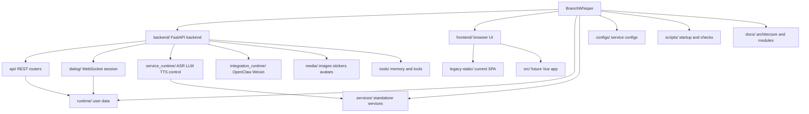
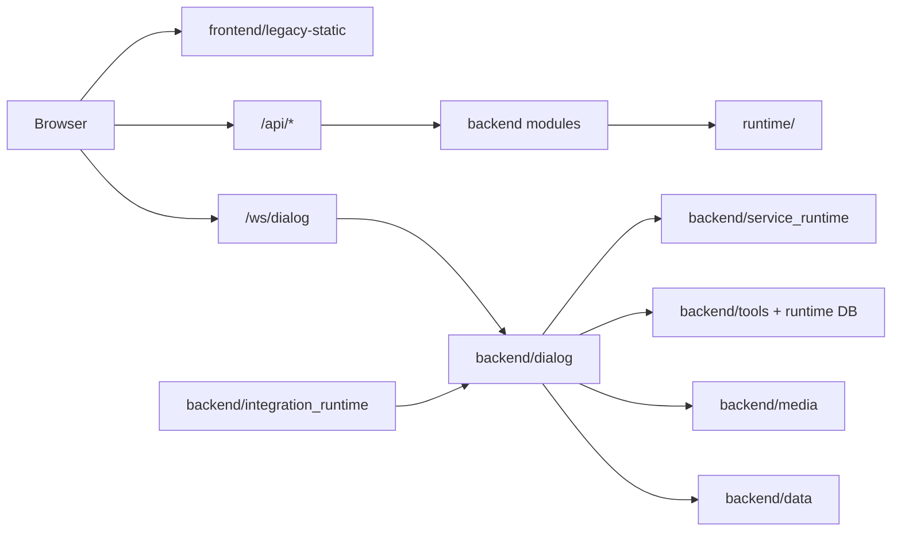
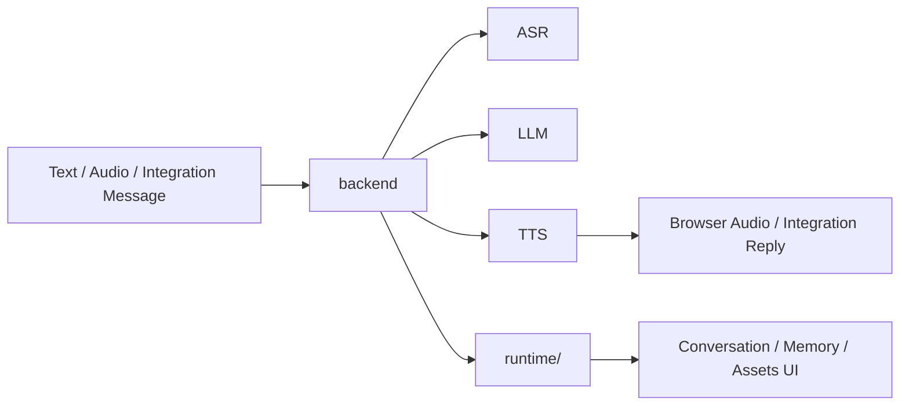

# Final Architecture

BranchWhisper is now organized around runtime responsibility.



## Module Dependency



## Data Flow



## Stable Boundaries

- `/api/*` remains unchanged.
- `/ws/dialog` remains unchanged.
- `/static/*` serves the legacy frontend.
- `/runtime/uploads/*` and `/runtime/stickers/*` remain public asset URLs.
## Runtime Compatibility

The runtime root is:

```text
runtime/
```
