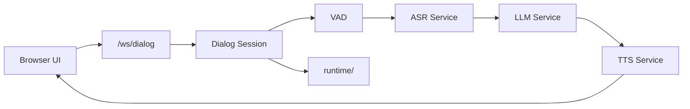

# BranchWhisper Architecture Overview

BranchWhisper is a local-first AI voice assistant console.

The product has four main areas:

- `backend/`: FastAPI APIs, WebSocket dialog, service control, memory, tools, integrations, media handling.
- `frontend/`: browser UI. The current UI is in `frontend/legacy-static/`; Vue migration will use `frontend/src/`.
- `runtime/`: local user data, settings, conversations, uploads, stickers, and logs.
- `services/`: standalone local services, currently the trained TTS API server.

## Core Flow

## Stable Interfaces

These routes are compatibility boundaries:

- `/api/config`
- `/api/services`
- `/api/conversations`
- `/api/memory`
- `/api/tools`
- `/api/health`
- `/ws/dialog`

Do not change route names, response fields, or WebSocket event shapes without a migration plan.

## Current Migration State

The code has been moved into clearer top-level directories, but large internal files such as `backend/app/server.py` and `backend/dialog/session.py` still preserve the old behavior. Split those files only in small, separately verified changes.
