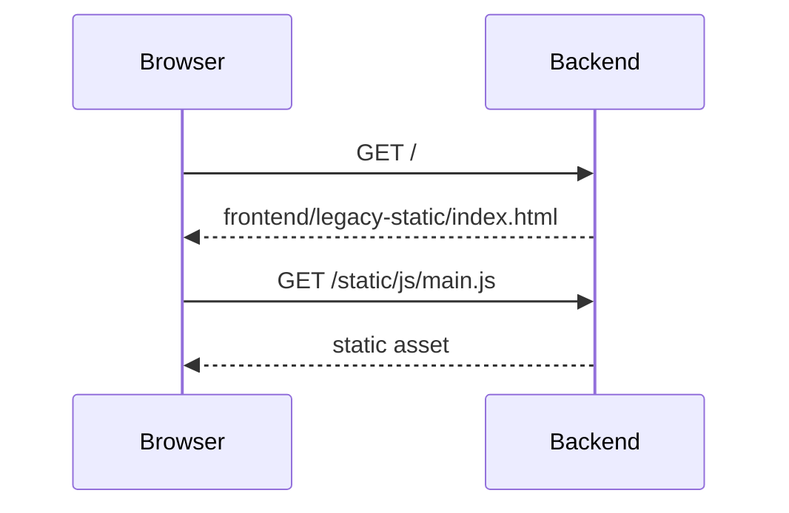
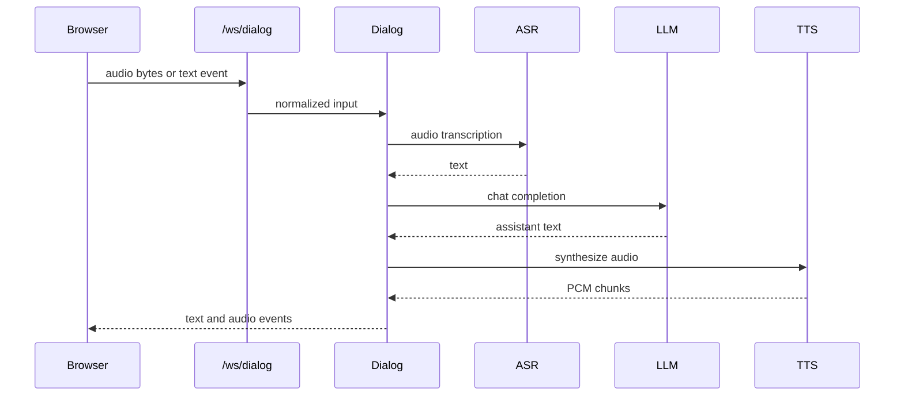

# Request Lifecycle

## Static Page

## Dialog WebSocket

## Service Control

The services page calls `/api/services/*`. The backend service manager starts or stops ASR, LLM, and TTS processes and writes logs to `runtime/logs/`.
